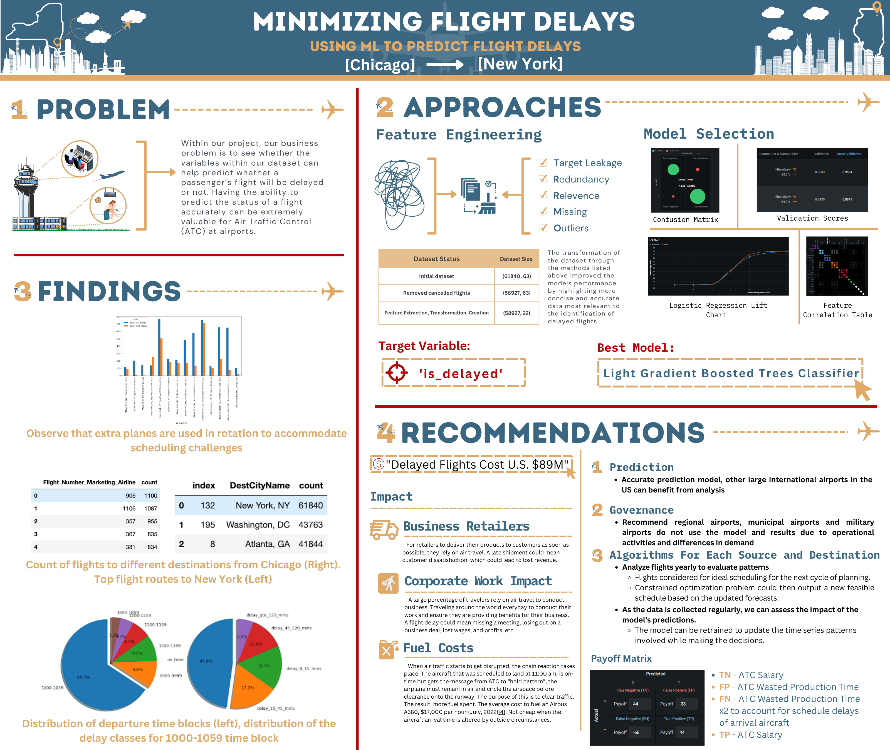

# Machine Learning modeling for Air Traffic Controllers to predict Flight Arrival Delays
Authors of this project: Ardavasd Ardhaldjian, Andrew Fogarty, Calisto Betti, Michael Fawehinmi, Shreedhar Kodate, & River Yan

This data product was part of a course at WPI. MIS 587 Business Applications In Machine Learning introduced us to all 
the business concepts relevant to apply Machine Learning tools and techniques as part of solving the business problems. 
The coursework also focussed on formulating business questions, addressing stakeholders concerns, 
presenting the exploratory data analysis, providing ML solutions, explaining the results, 
computing the business impact, and finally providing business recommendations.
To apply all these learnings, and to contribute to a real-world business problem of our team members' interest, 
we chose this project and dataset.

Dataset link: [https://www.kaggle.com/datasets/robikscube/flight-delay-dataset-20182022](https://www.kaggle.com/datasets/robikscube/flight-delay-dataset-20182022)

[Feature engineering and visualization code](src/chicago_IL_feature_engineering.ipynb)

### Infographic data product of the project

### Business memo
Air travel is one of the more highly demanded services in the world as the ability to travel large distances within 
hours, provides passengers and companies an expedited ability to travel. Before the COVID pandemic, the number of 
flights around the world was over 100,000 and the number of people flying was in the tens of millions. 
The pandemic took a critical hit to the industry’s demand, however since then, there has been a steady 
rise back to the pre-2019 numbers. On average, about 20% of flights get delayed for various reasons. 
When flights are delayed a chain reaction takes place that alters pre- established arrival and delay 
times, and causes immense financial impacts that–in 2019–negatively impacted the US economy by 
$38.3 billion. Our team conducted an analysis to see whether the feature variables within a dataset 
of flight delay information from 2018 to 2022, can be used to help predict whether a flight will be 
delayed or not. The purpose of this report is to assist air traffic controllers (ATC) at Chicago’s 
O’Hare International Airport, with their task of maintaining flight schedules.

With the initial dataset gathered, the team determined it was more practical to analyze a subset of
the information. We chose Chicago’s O’Hare Int. and evaluated the flight connections to John F. 
Kennedy International Airport because it was O’Hare’s most popular destination. The Flight Status 
Prediction dataset contained 71 flight status attributes for dates ranging back to January 2018. 
As we gathered our flare file extract from Kaggle, the raw data is extracted from the 
“Marketing Carrier On-Time Performance” data repository on the “On-Time” database from 
TransStats data library. Following this step, we were carefully able to execute some feature 
engineering and feature selection approaches to ensure we had a workable file before implementation
into DataRobot.

To determine which prediction model our team wanted to deploy we analyzed several different methods to effectively measure the performance of different models. The following evaluation techniques were conducted by our team to finalize which model to use:
- Lift chart analysis and comparing cross-validation scores
- Feature correlation analysis
- Confusion matrix

Following these model selection techniques, the team determined the best model for the use of assisting ATC with predicting flight delays, was the Gradient Boosted Trees Classifier with a cross- validation score of 2.6e-4.

The team concluded that the model we developed can be implemented for deployment to assist the ATC department at Chicago O’Hare International Airport, for the purpose of forecasting flight delay schedules to financially benefit those involved in the air travel industry. With the implementation of our model, the following steps need to be enforced to ensure future performance can be optimized and improved:
- Flights could be considered for ideal scheduling for the next cycle of planning.
  - A constrained optimization problem could then output a new feasible schedule based on the updated forecasts.
- As the data is collected regularly, we can assess the impact of the model's predictions.
  - The model can be retrained to update the time series patterns involved while making the decisions.

Model governance will also be enforced to ensure the analysis and results explained in our report are accurately implemented at similar airport facilities to O’Hare International. We do not recommend regional airports, municipal airports, or military airports use these results.

### Reports
1. [Project proposal report](reports/ProjectProposal.pdf)
2. [Project proposal presentation](reports/ProjectProposalPresentation.pdf)
3. [Final project report](reports/FinalProjectReport.pdf)